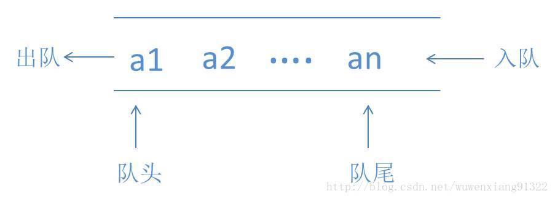

# 队列
## 队列的定义
队列（Queue）是只允许在一端进行插入，而在另一端进行删除的运算受限的线性表,即先进先出。




## 实现队列
Queue.java
```
public class Queue {
	//数组
	private long[] arr;
	//最大空间
	private int maxSize;
	//有效元素大小
	private int elems;
	//队头
	private int font;
	//队尾
	private int end;
	
	public Queue(int maxSize) {
		this.maxSize = maxSize;
		arr = new long[maxSize];
		elems = 0;
		font = 0;
		end = -1;
	}
	// 插入数据
	public void insert(long value) {
		arr[++end] = value;
		elems++;
	}
	//移除数据
	public long remove() {
		elems--;
		return arr[font++];
	}
	//是否为空
	public boolean isEmpty() {
		return (elems == 0);
	}
	//是否满了
	public boolean isFull() {
		return (end == maxSize - 1);
	}
	//返回有效元素大小
	public int size() {
		return elems;
	}
}
```
TestQueue.java
```
public class TestQueue {

	public static void main(String[] args) {
		// TODO Auto-generated method stub
		Queue queue = new Queue(5);
		System.out.println(queue.isEmpty());
		
		queue.insert(50);
		queue.insert(20);
		queue.insert(10);
		queue.insert(52);
		queue.insert(30);
		System.out.println(queue.isEmpty());
		System.out.println(queue.isFull());
		while(!queue.isEmpty()) {
			System.out.println(queue.remove());
		}
	}

}
```