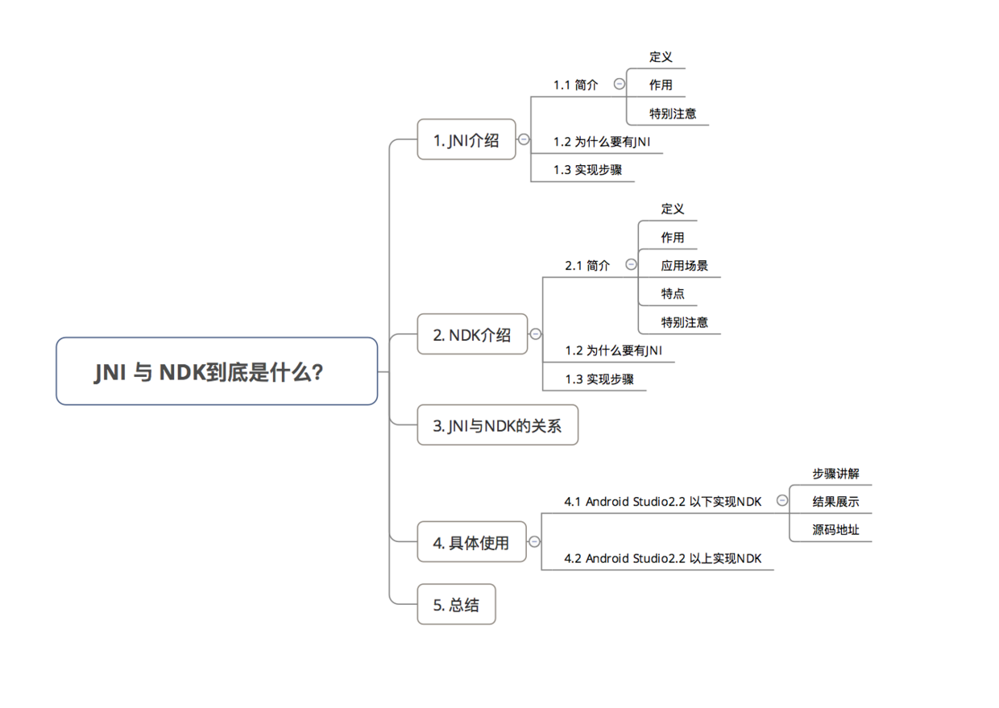
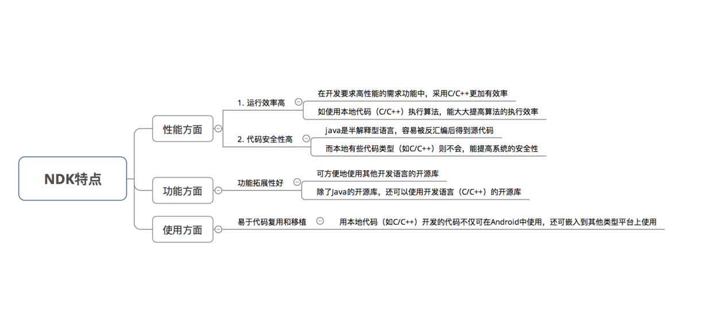
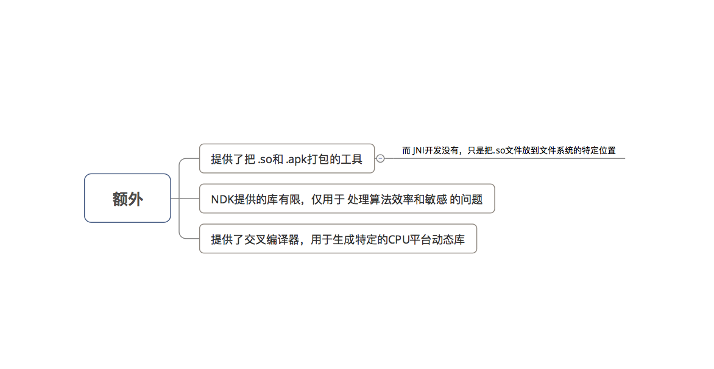
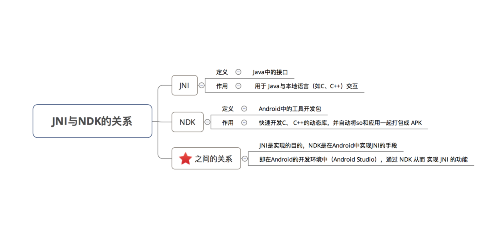
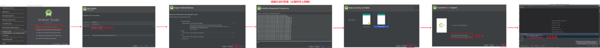
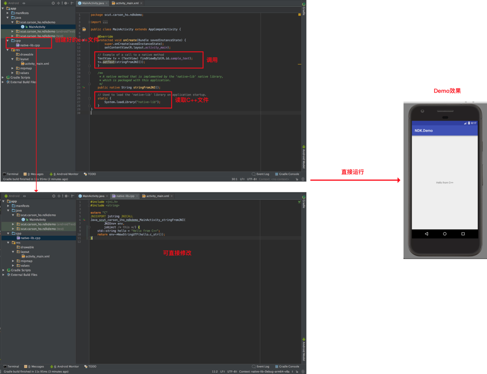

# Android：JNI 与 NDK到底是什么？（含实例教学）
摘自：[CSDN](http://blog.csdn.net/carson_ho/article/details/73250163)
## 前言
* 在Android开发中，使用 NDK开发的需求正逐渐增大
* 但很多人却搞不懂 JNI 与 NDK 到底是怎么回事
* 今天，我将先介绍JNI 与 NDK & 之间的区别，手把手进行 NDK的使用教学，希望你们会喜欢 
## 目录

### 1. JNI介绍
#### 1.1 简介
定义：Java Native Interface，即 Java本地接口
作用： 使得Java 与 本地其他类型语言（如C、C++）交互
>即在 Java代码 里调用 C、C++等语言的代码 或 C、C++代码调用 Java 代码

特别注意：

JNI是 Java 调用 Native 语言的一种特性
JNI 是属于 Java 的，与 Android 无直接关系
#### 1.2 为什么要有 JNI
背景：实际使用中，Java 需要与 本地代码 进行交互
问题：因为 Java 具备跨平台的特点，所以Java 与 本地代码交互的能力非常弱
解决方案： 采用 JNI特性 增强 Java 与 本地代码交互的能力
#### 1.3 实现步骤
1.在Java中声明Native方法（即需要调用的本地方法）
2.编译上述 Java源文件javac（得到 .class文件）
3.通过 javah 命令导出JNI的头文件（.h文件）
4.使用 Java需要交互的本地代码 实现在 Java中声明的Native方法 
>如 Java 需要与 C++ 交互，那么就用C++实现 Java的Native方法

5.编译.so库文件
6.通过Java命令执行 Java程序，最终实现Java调用本地代码

更加详细过程请参考本文第4节：具体使用

### 2. NDK介绍
#### 2.1 简介
* 定义：Native Development Kit，是 Android的一个工具开发包，NDK是属于 Android 的，与Java并无直接关系

* 作用：快速开发C、 C++的动态库，并自动将so和应用一起打包成 APK 即可通过 NDK在 Android中 使用 JNI与本地代码（如C、C++）交互

* 应用场景：在Android的场景下 使用JNI，即 Android开发的功能需要本地代码（C/C++）实现

* 特点

* 额外注意

#### 2.2 使用步骤
1.配置 Android NDK环境
2.创建 Android 项目，并与 NDK进行关联
3.在 Android 项目中声明所需要调用的 Native方法
4.使用 Android需要交互的本地代码 实现在Android中声明的Native方法 
>比如 Android 需要与 C++ 交互，那么就用C++ 实现 Java的Native方法

5.通过 ndk - bulid 命令编译产生.so库文件
6.编译 Android Studio 工程，从而实现 Android 调用本地代码

更加详细过程请参考本文第4节：具体使用

### 3. NDK与JNI关系

### 4.Android Studio2.2 以上实现NDK

如果你的Android Studio是2.2以上的，那么请采用下述方法

>因为Android Studio2.2以上已经内部集成 NDK，所以只需要在Android Studio内部进行配置就可以

#### 步骤讲解

##### 步骤1：按提示创建工程
在创建工程时，需要配置 NDK，根据提示一步步安装即可。

##### 步骤2：根据需求使用NDK
配置好NDK后，Android Studio会自动生成C++文件并设置好调用的代码，你只需要根据需求修改C++文件 & Android就可以使用了。
